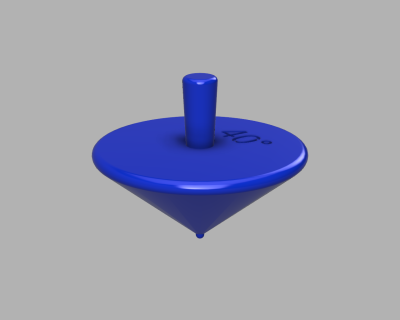
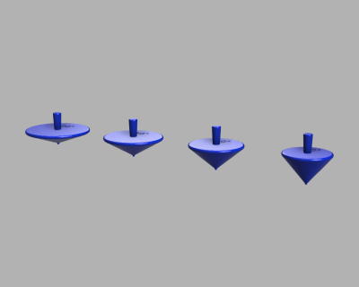
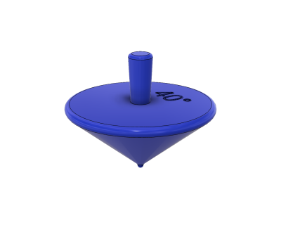
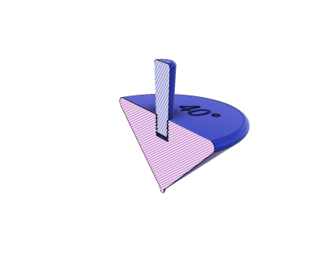

# Parametric Spinning Top (11/2018)

<table>
<tr>
<td></td>
<td></td>
</tr>
<tr>
<td></td>
<td></td>
</tr>
</table>

A parametric spinning top, with adjustable angle and height parameters and a common screw handle.

**Design**: [Spinning Top v8.f3d](Spinning%20Top%20v8.f3d) [Spinning Top Set v16.f3d](Spinning%20Top%20Set%20v16.f3d) (Fusion 360 Archive)

**Design**: https://a360.co/2EV0g0g https://a360.co/2R7cOEe (A360)

**STLs**:

  * [20 deg Body.stl](stls/20%20deg%20Body.stl)
  * [30 deg Body.stl](stls/30%20deg%20Body.stl)
  * [40 deg Body.stl](stls/40%20deg%20Body.stl)
  * [50 deg Body.stl](stls/50%20deg%20Body.stl)
  * [Handle.stl](stls/Handle.stl)

**Recommended Print Settings:** 0.15mm layer height, 20% infill

**License**: 
