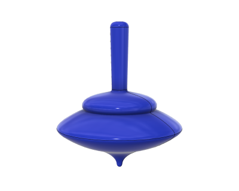
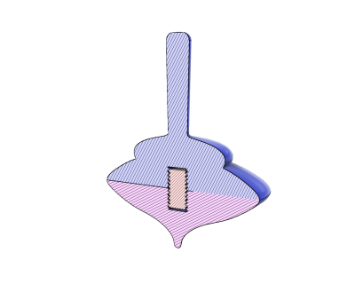
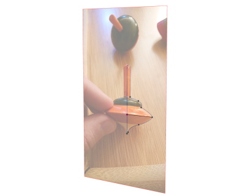

# Spinning Top Clone (11/2018)

<table>
<tr>
<td></td>
<td></td>
</tr>
<tr>
<td></td>
<td></td>
</tr>
<tr>
<td></td>
</tr>
</table>

A clone of an existing spinning top from a [photo](images/photo.jpg).

**Design**: [Spinning Top Clone v19.f3d](Spinning%20Top%20Clone%20v19.f3d) (Fusion 360 Archive)

**Design**: https://a360.co/2r8XCeo (A360)

**STLs**:

  * [Body Bottom.stl](stls/Body%20Bottom.stl)
  * [Body Top.stl](stls/Body%20Top.stl)
  * [Bolt.stl](stls/Bolt.stl)

**Recommended Print Settings:** 0.15mm layer height, 20% infill

**License**: 
